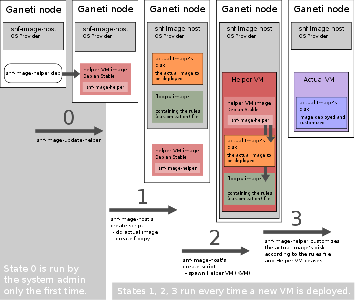

Architecture
============

Overview
^^^^^^^^

*snf-image* is a Ganeti OS definition. This means that Ganeti provisions a new
disk (block device) and passes it to *snf-image*. Then, *snf-image* is
responsible to deploy an Image on that disk. If *snf-image* returns
successfully, Ganeti will then spawn a VM with that disk as its primary disk.

Thus, *snf-image* is responsible for two (2) things, which are executed in two
separate steps:

| 1. Fill the newly provisioned disk with Image data
| 2. Customize the Image accordingly

For (1), *snf-image* can fetch the Image from a number of backends, as we
describe later. For (2) *snf-image* spawns a helper VM and runs a number of
configuration tasks inside the isolated environment. Once the last task returns
successfully, the helper VM ceases and *snf-image* returns the newly configured
disk to Ganeti.

The whole procedure is configurable via OS interface parameters, that can be
passed to *snf-image* from the Ganeti command line or RAPI.

*snf-image* is split in two components: The main program running on the Ganeti
host with full root privilege (*snf-image*, previously *snf-image-host*) and a
part running inside an unprivileged helper VM (*snf-image-helper*).

We describe each part in the following sections:

snf-image
^^^^^^^^^

This part implements the Ganeti OS interface. It extracts the Image onto the
Ganeti-provided block device, using streaming block I/O (dd with oflag=direct),
then spawns a helper VM, and passes control to *snf-image-helper* running
inside that helper VM. The helper VM is created using either KVM or XEN
depending on the supported hypervisor as dictated by Ganeti. It runs as an
unprivileged user.

There is no restriction on the distribution running inside the helper VM, as
long as it executes the *snf-image-helper* component automatically upon
boot-up.  The ``snf-image-update-helper`` script is provided with *snf-image*
to automate the creation of a helper VM image based on Debian Stable, using
``multistrap``.

The *snf-image-helper* component runs inside a specific environment, which is
created and ensured by *snf-image*:

 * The VM features a virtual floppy, containing an ext2 file system with all
   parameters needed for image customization.
 * The hard disk provided by Ganeti that we want to deploy and customize is
   accessible as the first VirtIO hard disk.
 * All kernel/console output is redirected to the first virtual serial console,
   and eventually finds its way into the OS definition log files that Ganeti
   maintains.
 * The helper VM is expected to output "SUCCESS" to its second serial port if
   image customization was successful inside the VM.
 * If "SUCCESS" is not returned, *snf-image* assumes that, execution of the
   helper VM or *snf-image-helper* has failed.
 * The helper VM is expected to shutdown automatically once it is done. Its
   execution is time-limited; if it has not terminated after a number of
   seconds, configurable via ``/etc/default/snf-image``, *snf-image* sends a
   SIGTERM and/or a SIGKILL to it.

snf-image-helper
^^^^^^^^^^^^^^^^

This part runs inside the helper VM during boot-up and undertakes customization
of the target disk. It does so, by running a number of :ref:`configuration
tasks <image-configuration-tasks>`. The exact tasks that should run, are
specified by rules found in the virtual floppy, placed there by *snf-image*,
before spawning the helper VM. *snf-image-helper* uses *runparts* to run the
tasks which are found under ``/usr/lib/snf-image-helper/tasks``.

Graphical Representation
^^^^^^^^^^^^^^^^^^^^^^^^

The architecture is presented below:

.. _storage-backends:

Storage backends
^^^^^^^^^^^^^^^^

As stated above, for step (1), *snf-image* is capable of fetching images that
are stored in a variety of different backends and then extracting them onto the
newly created block device. The following back-ends are supported:

 * **Local backend**:
   The local backend is used to retrieve images that are stored on the Ganeti
   node that the image deployment takes place. All local images are expected to
   be found under a predefined image directory. By default */var/lib/snf-image*
   is used, but the user may change this by overwriting the value of the
   *IMAGE_DIR* variable under ``/etc/default/snf-image``.

 * **Network backend**:
   The network backend is used to retrieve images that are accessible from the
   network. snf-image can fetch images via *http:*, *https:*, *ftp:* or
   *ftps:*, using `cURL <http://curl.haxx.se/>`_.

 * **Pithos backend**:
   *snf-image* contains a special command-line tool (*pithcat*) for retrieving
   images residing on a Pithos installation. To set up *snf-image*'s Pithos
   backend the user needs to setup the ``PITHOS_BACKEND_STORAGE`` variable
   inside ``/etc/default/snf-image``.
   Possible values are ``nfs`` and ``rados``. If ``nfs`` is used the user needs
   to setup *PITHOS_DATA* variable, and when ``rados`` is used the user needs
   to setup *PITHOS_RADOS_POOL_MAPS* and *PITHOS_RADOS_POOL_BLOCKS*
   accordingly.

 * **Null backend**:
   If the null backend is selected, no image copying is performed. This
   actually is meant for bypassing step (1) altogether. This is useful, if the
   disk provisioned by Ganeti already contains an OS installation before
   *snf-image* is executed (for example if the disk was created as a clone of
   an existing VM's hard disk).

.. _image-configuration-tasks:

Image Configuration Tasks
^^^^^^^^^^^^^^^^^^^^^^^^^

Configuration tasks are scripts called by *snf-image-helper* inside the helper
VM to accomplish various configuration steps on the newly created instance. See
below for a description of each one of them:

**FixPartitionTable**: Enlarges the last partition in the partition table of
the instance, to consume all the available space and optionally adds a swap
partition in the end. The task will fail if the environment variable
*SNF_IMAGE_DEV*, which specifies the device file of the instance's hard disk,
is missing.

**FilesystemResizeUnmounted**: Extends the file system of the last partition to
cover up the whole partition. This only works for ext{2,3,4}, FFS and UFS2 file
systems. Any other file system type is ignored and a warning is triggered. The
task will fail if *SNF_IMAGE_DEV* environment variable is missing.

**MountImage**: Mounts the root partition of the instance, specified by the
*SNF_IMAGE_PROPERTY_ROOT_PARTITION* variable. On Linux systems after the root
fs is mounted, the instance's ``/etc/fstab`` file is examined and the rest of
the disk file systems are mounted too, in a correct order. The script will fail
if any of the environment variables *SNF_IMAGE_DEV*,
*SNF_IMAGE_PROPERTY_ROOT_PARTITION* or *SNF_IMAGE_TARGET* is unset or has a
non-sane value.

**AddSwap**: Formats the swap partition added by *FixPartitionTable* task and
adds an appropriate swap entry in the system's ``/etc/fstab``. The script will
only run if *SNF_IMAGE_PROPERTY_SWAP* is present and will fail if
*SNF_IMAGE_TARGET* in not defined.

**DeleteSSHKeys**: On Linux and \*BSD instances, this script will clear out any
ssh keys found in the instance's disk. For Debian and Ubuntu systems, the keys
are also recreated. Besides removing files that comply to the
``/etc/ssh/ssh_*_key`` pattern, the script will also parses
``/etc/ssh/sshd_config`` file for custom keys. The only variable this script
depends on is *SNF_IMAGE_TARGET*.

**DisableRemoteDesktopConnections**: This script temporary disables RDP
connections on Windows instances by changing the value of *fDenyTSConnection*
registry key. RDP connections will be enabled back during the specialize pass
of the Windows setup. The task will fail if *SNF_IMAGE_TARGET* is not defined.

**InstallUnattend**: Installs the Unattend.xml files on Windows instances. This
is needed by Windows in order to perform an unattended setup. The
*SNF_IMAGE_TARGET* variables needs to be present for this task to run.

**SELinuxAutorelabel**: Creates *.autorelabel* file in Red Hat images. This is
needed if SELinux is enabled to enforce an automatic file system relabeling
during the first boot. The only environment variable required by this task is
*SNF_IMAGE_TARGET*.

**AssignHostname**: Assigns or changes the hostname of the instance. The task
will fail if the Linux distribution is not supported and ``/etc/hostname`` is
not present on the file system. For now, we support Debian, Red Hat, Slackware,
SUSE and Gentoo derived distributions. The hostname is read from
*SNF_IMAGE_HOSTNAME* variable. In addition to the latter, *SNF_IMAGE_TARGET* is
also required.

**ChangePassword**: Changes the password for a list of existing users. On Linux 
systems this is accomplished by directly altering the instance's
``/etc/shadow`` file. On Windows systems a script is injected into the VM's
hard disk. This script will be executed during the specialize pass of the
Windows setup. On \*BSD systems ``/etc/master.passwd`` is altered,
``/etc/spwd.db`` is removed and a script is injected into the VM's hard disk
that will recreate the aforementioned file during the first boot. The list of
users whose passwords will changed is determined by the
*SNF_IMAGE_PROPERTY_USERS* variable (see :ref:`image-properties`). For this
task to run *SNF_IMAGE_TARGET* and *SNF_IMAGE_PASSWD* variables need to be
present.

**ConfigureNetwork**: Edit the OS's native network configuration files to
configure the instance's NICs. This works for most Linux and all the supported
\*BSD systems. In order to do this, all the NIC_* Ganeti provided environment
variables are exported to the task. The only variable required by this task is
*SNF_IMAGE_TARGET*. For this task to work correctly, the user may need to
adjust the *DHCP_TAGS* and the *\*_DHCPV6_TAGS* configuration parameters (see
:doc:`/configuration`).

**FilesystemResizeMounted**: For Windows VMs this task injects a script into
the VM's file system that will enlarge the last file system to cover up the
whole partition. The script will run during the specialize pass of the Windows
setup. For Linux VMs this task is used to extend the last file system in case
its type is Btrfs or XFS, since those file systems require to be mounted in
order to resize them. If the *SNF_IMAGE_TARGET* variable is missing, the task
will fail.

**EnforcePersonality**: Injects the files specified by the
*SNF_IMAGE_PROPERTY_OSFAMILY* variable into the file system. If the variable is
missing a warning is produced. Only *SNF_IMAGE_TARGET* is required for this
task to run.

**RunCustomTask**: Run a user-defined task specified by the
*SNF_IMAGE_PROPERTY_CUSTOM_TASK* variable. If the variable is missing or empty,
a warning is produced.

**UmountImage**: Umounts the file systems previously mounted by MountImage. The
only environment variable required is *SNF_IMAGE_TARGET*.

+-------------------------------+---+--------------------------------------------+----------------------------------------------+
|                               |   |               Dependencies                 |         Enviromental Variables [#]_          |
+          Name                 |   +------------------+-------------------------+-------------------------+--------------------+
|                               |Pr.|        Run-After |        Run-Before       |        Required         |   Optional         |
+===============================+===+==================+=========================+=========================+====================+
|FixPartitionTable              |10 |                  |FilesystemResizeUnmounted|DEV                      |                    |
+-------------------------------+---+------------------+-------------------------+-------------------------+--------------------+
|FilesystemResizeUnmounted      |20 |FixPartitionTable |MountImage               |DEV                      |                    |
+-------------------------------+---+------------------+-------------------------+-------------------------+--------------------+
|MountImage                     |30 |                  |UmountImage              |DEV                      |                    |
|                               |   |                  |                         |TARGET                   |                    |
|                               |   |                  |                         |PROPERTY_ROOT_PARTITION  |                    |
+-------------------------------+---+------------------+-------------------------+-------------------------+--------------------+
|AddSwap                        |40 |MountImage        |EnforcePersonality       |TARGET                   |PROPERTY_OSFAMILY   |
|                               |   |                  |                         |                         |PROPERTY_SWAP       |
+-------------------------------+---+------------------+-------------------------+-------------------------+--------------------+
|DeleteSSHKeys                  |40 |MountImage        |EnforcePersonality       |TARGET                   |PROPERTY_OSFAMILY   |
+-------------------------------+---+------------------+-------------------------+-------------------------+--------------------+
|DisableRemoteDesktopConnections|40 |EnforcePersonality|UmountImage              |TARGET                   |PROPERTY_OSFAMILY   |
+-------------------------------+---+------------------+-------------------------+-------------------------+--------------------+
|InstallUnattend                |40 |MountImage        |EnforcePersonality       |TARGET                   |PROPERTY_OSFAMILY   |
+-------------------------------+---+------------------+-------------------------+-------------------------+--------------------+
|SELinuxAutorelabel             |40 |MountImage        |EnforcePersonality       |TARGET                   |PROPERTY_OSFAMILY   |
+-------------------------------+---+------------------+-------------------------+-------------------------+--------------------+
|AssignHostname                 |50 |InstallUnattend   |EnforcePersonality       |TARGET                   |                    |
|                               |   |                  |                         |HOSTNAME                 |PROPERTY_OSFAMILY   |
+-------------------------------+---+------------------+-------------------------+-------------------------+--------------------+
|ChangePassword                 |50 |InstallUnattend   |EnforcePersonality       |TARGET                   |PROPERTY_USERS      |
|                               |   |                  |                         |                         |PROPERTY_OSFAMILY   |
|                               |   |                  |                         |                         |PASSWD              |
+-------------------------------+---+------------------+-------------------------+-------------------------+--------------------+
|ConfigureNetwork               |50 |InstallUnattend   |EnforcePersonality       |TARGET                   |NIC_*               |
+-------------------------------+---+------------------+-------------------------+-------------------------+--------------------+
|FilesystemResizeMounted        |50 |InstallUnattend   |EnforcePersonality       |TARGET                   |PROPERTY_OSFAMILY   |
+-------------------------------+---+------------------+-------------------------+-------------------------+--------------------+
|EnforcePersonality             |60 |MountImage        |UmountImage              |TARGET                   |PERSONALITY         |
|                               |   |                  |                         |                         |PROPERTY_OSFAMILY   |
+-------------------------------+---+------------------+-------------------------+-------------------------+--------------------+
|RunCustomTask                  |70 |MountImage        |UmountImage              |TARGET                   |PROPERTY_CUSTOM_TASK|
+-------------------------------+---+------------------+-------------------------+-------------------------+--------------------+
|UmountImage                    |80 |MountImage        |                         |TARGET                   |                    |
+-------------------------------+---+------------------+-------------------------+-------------------------+--------------------+

.. [#] all environment variables are prefixed with *SNF_IMAGE_*
